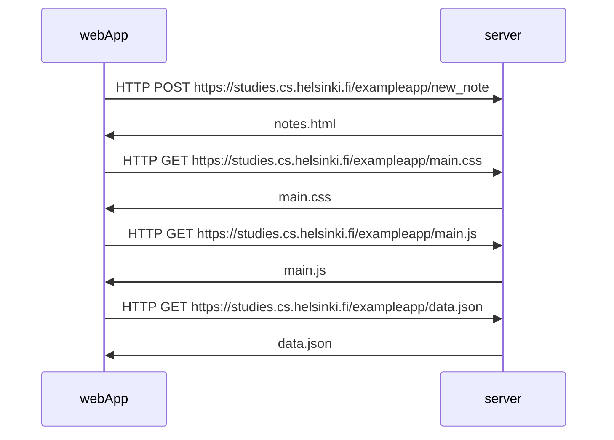

```mermaid
sequenceDiagram
     participant webApp
     participant server
     webApp->>server: HTTP POST https://studies.cs.helsinki.fi/exampleapp/new_note
     server->>webApp: notes.html
     webApp->>server: HTTP GET https://studies.cs.helsinki.fi/exampleapp/main.css
     server->>webApp: main.css
     webApp->>server: HTTP GET https://studies.cs.helsinki.fi/exampleapp/main.js
     server->>webApp: main.js
     webApp->>server: HTTP GET https://studies.cs.helsinki.fi/exampleapp/data.json
     server->>webApp: data.json
```
